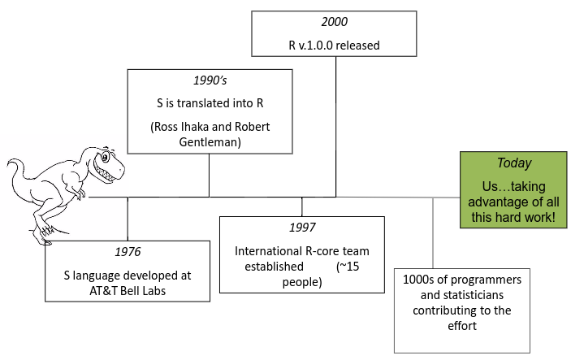

# Introduction {#intro}

- A bit about me
- Intros
- What is everyone's experience level?
- What are you expected to know?
  
  + Basic R objects and methods
  + `tidyverse` packages and syntax
    - i.e. `ggplot2`, `dplyr`, `readr`, `tidyr`, the pipe operator %>% 
  + If these are new, don't sweat it - google them, we'll talk through them as we go if needed
  
- This portion of workshop expectation no expectation of experience with spatial in R - we'll cover all the basics

What is R and why should we use R for spatial analysis? Let’s break that into two questions - first, what is R and why should we use it?

- A language and environment for statistical computing and graphics
- R is lightweight, free, open-source and cross-platform
- Works with contributed packages - currently 12,938 -extensibility
- Automation and recording of workflow (reproducibility)
- Optimized work flow - data manipulation, analysis and visualization all in one place
- R does not alter underlying data - manipulation and visualization in memory
- R is great for repetetive graphics

```{r my-fig, fig.cap="History of R", echo=FALSE}

```


## Workshop agenda

## Spatial Data in R


## Code along
Just a sampling of what we'll cover.  Run code, examine output, ask any questions - we'll explore it all in more detail through the morning.

### geocoding example with tmaptools using open street map

```{r geocode-osm example}
# uses OSM
library(tmap)
library(tmaptools)
library(dplyr)
tex_cap <-tmaptools::geocode_OSM("Texas Capital", 
        as.sf = TRUE) %>% 
  glimpse()
```

### interactive mapping

```{r mapview example}
library(mapview)
mapview(tex_cap)
```

### Choropleth map
The package maps (automatically installed and loaded with ggplot2) provides maps of the USA, with state and county borders, that can be retrieved and converted as sf objects:
```{r tmap example}
library(sf)
library(maps)
counties <- st_as_sf(map("county", plot = FALSE, fill = TRUE))
counties <- subset(counties, grepl("texas", counties$ID) & !grepl('missouri,texas',counties$ID))
counties$area <- as.numeric(st_area(counties))
head(counties)

tm_shape(counties) +
  tm_polygons("area", 
              style="quantile", 
              title="Texas Counties Area")
```


## Challenge: Does this work? {.challenge}

Did my .css styling adjustment work?

### Answer {.solution} 

1. Yes
2. No
