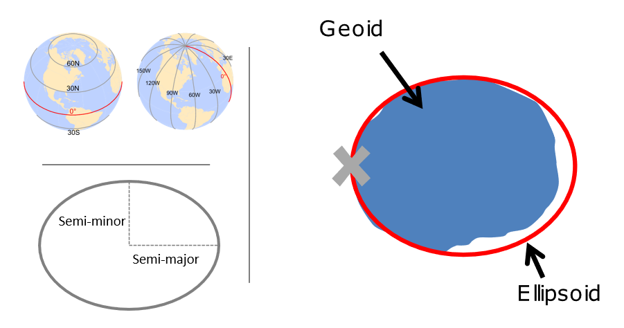

# Coordinate reference systems

## Lesson Objectives
Describe and understand a `CRS` in R and components of a `CRS`

A `CRS` is made up of several components:

- **Coordinate system**: The x,y grid that defines where your data lies in space
- **Horizontal and vertical units**: The units describing grid along the x,y and possibly z axes
- **Datum**: The modeled version of the shape of the earth
- **Projection details**: If projected, the mathematical equation used to flatten objects from round surface (earth) to flat surface (paper or screen)

```{r, fig.cap="Source: https://mgimond.github.io/Spatial/coordinate-systems.html", echo=FALSE, out.width="75%"}

```

The earth is a sphere, but more precisely, an *ellipsoid*, which is defined by two radii: 
- semi-major axis (equatorial radius)
- semi-minor axis (polar radius)

We know with precision that the measure of these two are 6,378,137 meters and 6,356,752 meters respectively.

More precisely that an *ellipsoid*, though, we know that earth is a *geoid* - it is not perfectly smooth - and modelling the the undulations due to changes in gravitational pull for different locations is crucial to accuracy in a GIS. This is where a *datum* comes in - we match the geoid to the ellipsoid to best match local conditions.  We have many datums to choose from based on location of interest - in the US we would typically choose *NAD83*

### Why you need to know about CRS working with spatial data in R:
```{r crs_fail, message=FALSE, warning=FALSE, error=FALSE}
library(awra2020spatial)
library(readr)
library(sf)
data(pnw)

gages = read_csv(system.file("extdata/Gages_flowdata.csv", package = "awra2020spatial"))

gages_sf <- gages %>%
  st_as_sf(coords = c("LON_SITE", "LAT_SITE"), crs = 4269, remove = FALSE) %>%
  dplyr::select(STATION_NM,LON_SITE, LAT_SITE)

# Awesome, let's plot our gage data and state boundaries!
plot(pnw$geometry, axes=TRUE)
plot(gages_sf$geometry, col='red', add=TRUE)
# um, what?
```
There is no 'on-the-fly' projection in R - you need to make sure you specify the CRS of your objects, and CRS needs to match for any spatial operations or you'll get an error

- [spatialreference.org](https://spatialreference.org/) is your friend in R - chances are you will use it frequently working with spatial data in R.

- Useful `rgdal` package functions:
  + projInfo(type='datum')
  + projInfo(type='ellps')
  + projInfo(type='proj')

### Changes to CRS recently in R in `sf`

It's important to [understand recent changes](https://www.r-spatial.org/r/2020/03/17/wkt.html#crs-objects-in-sf) in handling of `crs` in `sf`
Prior to `sf` 0.9, `crs` were represented as lists with two components:
- `epsg` (European Petroleum Survey Group ) code, which could be NA
- `proj4string` - a projection string

```
library(sf) 
# Linking to GEOS 3.8.0, GDAL 3.0.2, PROJ 6.2.1
st_crs(4326)
# Coordinate Reference System:
#   EPSG: 4326
#   proj4string: "+proj=longlat +datum=WGS84 +no_defs"
```
Now, however, `sf` represents `crs` as lists with two different components:
- `input`
- `wkt`

```
library(sf)

## Linking to GEOS 3.8.0, GDAL 3.0.2, PROJ 6.2.1

(x = st_crs(4326))

## Coordinate Reference System:
##   User input: EPSG:4326 
##   wkt:
## GEOGCRS["WGS 84",
##     DATUM["World Geodetic System 1984",
##         ELLIPSOID["WGS 84",6378137,298.257223563,
##             LENGTHUNIT["metre",1]]],
##     PRIMEM["Greenwich",0,
##         ANGLEUNIT["degree",0.0174532925199433]],
##     CS[ellipsoidal,2],
##         AXIS["geodetic latitude (Lat)",north,
##             ORDER[1],
##             ANGLEUNIT["degree",0.0174532925199433]],
##         AXIS["geodetic longitude (Lon)",east,
##             ORDER[2],
##             ANGLEUNIT["degree",0.0174532925199433]],
##     USAGE[
##         SCOPE["unknown"],
##         AREA["World"],
##         BBOX[-90,-180,90,180]],
##     ID["EPSG",4326]]
```

You can still get the `proj4string` or `epsg` value by:

```
x$epsg

## [1] 4326

x$proj4string

## [1] "+proj=longlat +datum=WGS84 +no_defs"
```

### Projected coordinate systems
Typically we want to work with data that is projected. Projected coordinate systems (which are based on Cartesian coordinates) have: an origin, an x axis, a y axis, and a linear unit of measure. Going from geographic coordinates to a projected coordinate reference systems requires mathematical transformations. 

Four spatial properties of projected coordinate systems that are subject to distortion are: *shape*, *area*, *distance* and *direction*. A map that preserves shape is called *conformal*; one that preserves area is called *equal-area*; one that preserves distance is called *equidistant*; and one that preserves direction is called *azimuthal* (from [https://mgimond.github.io/Spatial/coordinate-systems.html](https://mgimond.github.io/Spatial/coordinate-systems.html).


The takeaway from all this is you need to be aware of the `crs` for your objects in R, make sure they are projected if appropriate and in a projection that optimizes properties you are interested in, and objects you are analyzing or mapping together need to be in same `crs`.  

Going back to our original example, we can transform `crs` of objects to work with them together:

```{r crs_fix, message=FALSE, warning=FALSE, error=FALSE}
library(ggplot2)
# Check our coordinate reference systems
st_crs(gages_sf)
st_crs(pnw)
# Are they equal?
st_crs(gages_sf)==st_crs(pnw)
# transform one to the other
gages_sf <- st_transform(gages_sf, st_crs(pnw))
ggplot() + 
  geom_sf(data=gages_sf,  color="blue") +
  geom_sf(data=pnw,  color="black", fill=NA) +
  labs(title="USGS Stream Gages in the Pacific Northwest") +
  theme_bw() 
```