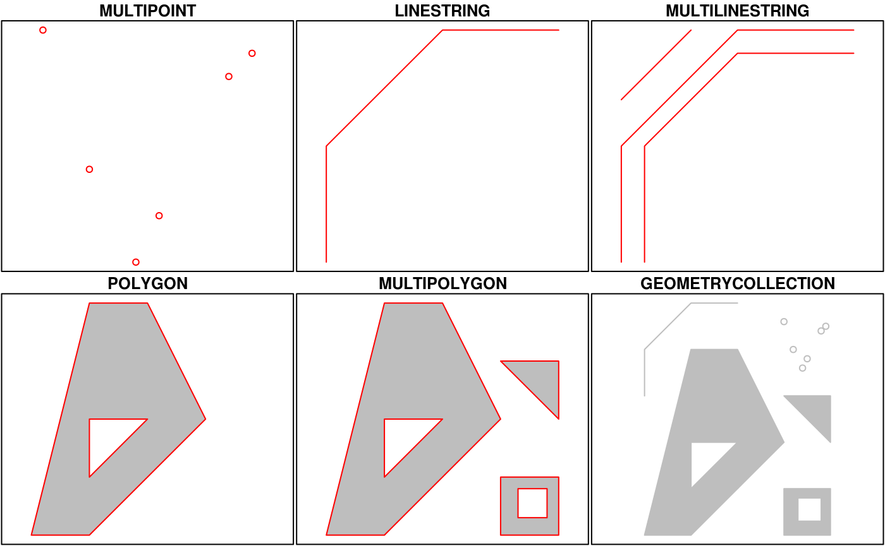

# Vector data with `sf`

```{r, fig.cap="Sticky geometry with `sf`", echo=FALSE, out.width="150%"}
knitr::include_graphics("images/Sticky.png")
```

`sf` makes use of a couple key libraries that are the foundation for most open source geospatial software
```{r, fig.cap="Source: https://www.r-spatial.org/r/2020/03/17/wkt.html ", echo=FALSE, out.width="150%"}
knitr::include_graphics("images/sf_deps.png")
```

`sf` is an implementation of [Simple features](https://en.wikipedia.org/wiki/Simple_Features), an open standard developed and endorsed by the Open Geospatial Consortium (OGC). Simple Features is a hierarchical data model that represents a wide range of geometry types - it includes all common vector geometry types (but does not include raster) and even allows geometry collections, which can have multiple geometry types in a single object.  From the first `sf` package vignette we see:

```{r }

```

The big difference between `sf` and `sp` is that `sf` uses S3 classes rather than S4 as `sp` does.  Simple features are simple `data.frame` objects that have a geometry list-column. The simple feature model will be familiar to those who use [PostGIS](https://en.wikipedia.org/wiki/PostGIS), [MySQL Spatial Extensions](https://en.wikipedia.org/wiki/MySQL), [Oracle Spatial](https://en.wikipedia.org/wiki/Oracle_Spatial_and_Graph), the [OGR component of the GDAL library](https://en.wikipedia.org/wiki/GDAL), [GeoJSON](https://datatracker.ietf.org/doc/rfc7946/) and [GeoPandas](http://geopandas.org/) in Python.  Simple features are represented with Well-Known text - [WKT](https://en.wikipedia.org/wiki/Well-known_text) - and well-known binary formats.

Just as in `PostGIS`, all functions and methods in `sf` are prefixed with `st_`, which stands for 'spatial and temporal'.  An advantage of this prefixing is all commands are easy to find with command-line completion in `sf`.

There is extensive documentation, blog posts and vignettes available for `sf` here:
[Simple Features for R](https://github.com/edzer/sfr).  Additionally, see [r-spatial blog](http://r-spatial.org/) which has numerous announcements, discussion pieces and tutorials on spatial work in R focused. 

A very handy page, if you're already familiar with the `sp` ecosystem, is the [Migrating](https://github.com/r-spatial/sf/wiki/migrating) page on the [sf GitHub wiki](https://github.com/r-spatial/sf/wiki).

Here's a quick synopsis of available methods in `sf`:
```{r sf_methods, message=FALSE, warning=FALSE, error=FALSE}
library(sf)
methods(class = 'sf')
```

Let's start exploring `sf` using some data included in the awra2020spatial package.

```{r gages2, message=FALSE, warning=FALSE, error=FALSE}
library(awra2020spatial)
data(bike_paths)
head(bike_paths[,c('ROUTE_CODE','ROUTE_NAME','geoms')])
```

Let's break down what we just saw in bike paths, which is bike paths in Austin - from the first `sf` package vignette:

```{r }
knitr::include_graphics("images/sf_structure.png")
```

We can see:

* in green a simple feature: a single record, or data.frame row, consisting of attributes and geometry
* in blue a single simple feature geometry (an object of class sfg)
* in red a simple feature list-column (an object of class sfc, which is a column in the data.frame)

The `sfc`, our geometry list-column, is presented as *well-known text*, in the form of (for polygon data):

* Multipolygon(polygon1, polygon2)

polygon1 might have 1 or more holes, and itself could be represented as (poly1, hole1, hole2).

Each polygon and its holes are held together by a set of parentheses, so:

* Multipolygon(((list of coordinates))) indicates the exterior ring coordinates, going counter-clockwise in direction, without holes, of the first polygon.

Generic plotting works on `sf` objects - take a minute to play with ploting the bike paths data frame - why do we specify `$geometry` in the plot call?
```{r sf_plot, message=FALSE, warning=FALSE, error=FALSE}
plot(bike_paths$geoms, axes=T)
```


### Units in `sf`
The `crs` in `sf` encodes the units of measure in information relating to spatial units of features - this can be both handy and very confusing for those new to it.  Consider the following:

```{r}
(sum(st_length(bike_paths)))
```
 
We can set units if we do manipulations as well using the `units` package  
```{r}
units::set_units(sum(st_length(bike_paths)),km)
```

If we need to use the value elsewhere get rid of units 
```{r}
as.numeric(sum(st_length(bike_paths)))
```
