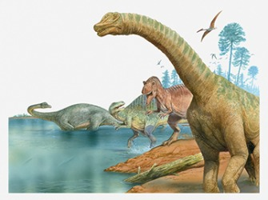

--- 
title: "Fundamentals of Spatial Analysis in R"
author: "Marc Weber"
date: "`r Sys.Date()`"
description: This is a draft of material for the Fundamentals of Spatial Analysis
  in R workshop at the AWRA Spring Conference in Austin in March 2020.
documentclass: book
site: bookdown::bookdown_site
always_allow_html: yes
---

# Introduction {#intro}

```{r, fig.cap="A bit about me", echo=FALSE, out.width="150%"}
knitr::include_graphics("images/WordCloud.png")
```

- Workshop agenda
  
  + Intro and quick review of basic R objects and methods
  + Getting spatial data into R
  + Understanding vector and raster data in R and some example workflows
  + Understanding coordinate reference systems (CRS)
  + Learning ways to map and visualize spatial data
  + Along the way: overview of select `tidyverse` packages and syntax
    - i.e. `ggplot2`, `dplyr`, `readr`, `tidyr`, the pipe operator %>% 
  + Working with vector and raster data in R
  + If this is all new, don't sweat it - google things, we'll answer questions as we go
- This portion of workshop there is no expectation of experience with spatial analysis in R - if you already have some experience, you are sure to pick up new tricks - if you don't, we'll cover the basics
- We have a limited time to cover a very broad topic, so I'll move quickly - ask questions as they come up, but if you get lost on steps we'll have time for discussion at the end and material will be available to peruse at your own speed later.

## Workshop Packages and Data
- Packages you need installed
  + `sf`
  + `raster`
  + `ggplot2`
  + `stars`
  + `tmap`
  + `tmaptools`
  + `dplyr`
  + `devtools`
  + `palmerpenguins`
  + `tigris`
  + `tibble`
  + `rgdal`
  + `leaflet`
  + `mapview`
  + [awra2020spatial](https://github.com/mhweber/awra2020spatial) - data for this workshop contained in package
  
- Downloading content via Github

- Using RMarkdown and RStudio


## Overview 
```{r, fig.cap="History of R", echo=FALSE, out.width="150%"}
knitr::include_graphics("images/History of R.png")
```

What is R and why should we use R for spatial analysis? Let’s break that into two questions - first, what is R and why should we use it?

- A language and environment for statistical computing and graphics
- R is lightweight, free, open-source and cross-platform
- Works with contributed packages - currently 15,362 - extensibility
- Automation and recording of workflow (reproducibility)
- Optimized work flow - data manipulation, analysis and visualization all in one place
- R does not alter underlying data - manipulation and visualization in memory
- R is great for repetetive graphics

Second, why use R for spatial, or GIS, work?

- Spatial and statistical analysis in one environment
- Leverage statistical power of R (i.e.  modeling spatial data, data visualization, statistical exploration)
- Can handle vector and raster data, as well as work with spatial databases and pretty much any data format spatial data comes in
- R's GIS capabilities growing rapidly right now - new packages added monthly - currently about 200 spatial packages (depending on how you categorize)

Some drawbacks to using R for GIS work

- R not as good for interactive use as desktop GIS applications like ArcGIS or QGIS (i.e. editing features, panning, zooming, and analysis on selected subsets of features)
- Explicit coordinate system handling by the user, no on-the-fly projection support
- In memory analysis does not scale well with large GIS vector and tabular data
- Steep learning curve
- Up to you to find packages to do what you need - help not always great

## R Basics Review 

```{r, eval=FALSE}
getwd()
```

Which should return something like:
```
[1] "/home/marc/GitProjects/AWRA_GIS_R_Workshop"
```

To see what is in the directory:
```{r}
dir()
```

To establish a different directory:
```
setwd("/home/marc/GitProjects")
```

#### **Terminology: data structures**
R is an interpreted language (access through a command-line interpreter) with a number of data structures (vectors, matrices, arrays, data frames, lists) and extensible objects (regression models, time-series, geospatial coordinates) and supports procedural programming with functions. 

To learn about objects, become friends with the built-in `class` and `str` functions. Let's explore a new dataset - [palmerpenguins](https://github.com/allisonhorst/palmerpenguins) - recently developed by Allison Horst as an alternative to the old R standby `iris` dataset:

```{r, message=FALSE, warning=FALSE}
library(palmerpenguins)
class(penguins)
```

```{r}
str(penguins)
```

`penguins` is a [tibble](https://tibble.tidyverse.org/), which is a new `tidyverse` spin on `data frames`, and was created as a new alternative to the `iris` data set that has been used extensively for beginning tutorials on learning R. Data frames consist of rows of observations  on columns of values for variables of interest - they are one of the fundamental and most important data structures in R. `tibbles` make a few improvements / changes to `data frames` such as:

  - Never converting strings to factors
  - Never creating row names
  - Updated print method that only shows first 10 rows, just the columns that fit on the screen, and the type of each column (just as we get using `str`)

We can easily convert objects from `tibble` to `data frame` and vice versa:
```{r, warning=FALSE, message=FALSE}
library(tibble)
penguins <- as.data.frame(penguins)
penguins <- as_tibble(penguins)
```

But as we see in the result of `str(penguins)` above, following the information that `penguins` is a `tibble` with 344 observations of 8 variables, we get information on each of the variables, in this case that 2 are numeric, 2 are integers, and 3 are factors - factors encode categorical variables - and `str` gives us the number of levels in each factor.

First off, R has several main data types:

* logical
* integer
* double
* complex
* character
* raw
* list
* NULL
* closure (function)
* special
* builtin (basic functions and operators)
* environment
* S4 (some S4 objects)
* others you won't run into at user level

We can ask what data type something is using `typeof`:
```{r}
typeof(penguins)
```

```{r}
typeof(penguins$bill_length_mm)
```

```{r}
typeof(penguins$species)
```

We see a couple interesting things here - `penguins`, which we just said is a `tibble`, is a data type of `list`.  `bill_length_mm` is data type `double`, and in `str(penguins)` we saw it was numeric - that makes sense - but we see that `species` is data type `integer`, and in `str(penguins)` we were told this variable was a factor with three levels.  What's going on here?

First off, `class` refers to the abstract type of an object in R, whereas `typeof` or `mode` refer to how an object is stored in memory. So `penguins` is an object of class `tibble`, but it is stored in memory as a list (i.e. each column is an item in a list).  Note that this allows tibbles and data frames to have columns of different classes, whereas a matrix needs to be all of the same mode.

For our `species` column, we see it's `mode` is numeric, it's `typeof` is `integer`, and it's class is `factor`.  Nominal variables in R are treated as a vector of integers 1:k,  where k is the number of unique values of that nominal variable and a mapping of the character strings to these integer values.  

This allows us to quickly see see all the unique values of a particular nominal variable or quickly re-asign a level of a nominal variable to a new value - remember, everything in R is in memory, so don't worry about tweaking the data!

```{r}
levels(penguins$species)
levels(penguins$species)[1] <- 'adeliae'
```

See if you can explain how that re-asignment we just did worked.

To access particular columns in a `tibble` or `data frame`, as we saw above, we use the `$` operator. We can see the value of `species` for each observation in `penguins` as well as listing of all levels of the variable by running:
```{r}
penguins$species
```

To access particular columns or rows of a data frame, we use indexing:
```{r}
penguins[1,3] # the 1st row and the 3rd column
```

```{r}
penguins[4,1] # the 4th row and the 1st column
```

A handy function is `names`, which you can use to get or to set data frame variable names:
```{r}
names(penguins)
names(penguins)[3] <- 'Bill Length'
```

Explain what this last line did

A little example of tidy evaluation and piping to do the same thing - we'll go into more:
```{r}
penguins <- penguins %>% 
  dplyr::rename('Bill_Length'='Bill Length')
# check it
names(penguins)
```


#### **Review of Classes and Methods**

- Class: object types
    - `class()`: gives the class type 
    - `typeof()`: information on how the object is stored
    - `str()`: how the object is structured
- Method: generic functions
    - `print()`
    - `plot()`
    - `summary`()

## Spatial Data in R

We can represent spatial data as discrete locations (points, lines or polygons) or as a grid of values rendered on a map as pixels. We typically represent the former type of data (discrete locations) as *vector* data, with an associated geometry or shape, and some attributes with information about the locations. Examples are:

- state boundaries with state name and population
- rivers with their flow volume and names
- polygons of watersheds with their names and associated landscape information

We represent the latter type of data (a grid of values as pixels) with *rasters*.  Rasters can be continous (i.e. elevation, precipitation, atmospheric deposition) or they can be categorical (i.e. land use, soil type) - they can also be image based rasters, and they can be single band or multi-band.

```{r, fig.cap="Raster Data", echo=FALSE, out.width="100%"}
knitr::include_graphics("images/Rasters4.png")
```

We will delve into working with each of these types of data in their own sections, but let's go over how these spatial data types are handled in R briefly.

Basic data structures in R can represent spatial data - all we need is some vectors with location and attribute information - below we generate cites with population, add a polygon, and make a map with a legend - take a minute to run this code in your own R session and make sure you understand what each line is doing.

```{r basic spatial data structures vector}
cities <- c('Ashland','Corvallis','Bend','Portland','Newport')
longitude <- c(-122.699, -123.275, -121.313, -122.670, -124.054)
latitude <- c(42.189, 44.57, 44.061, 45.523, 44.652)
population <- c(20062,50297,61362,537557,9603)
locs <- cbind(longitude, latitude) 
plot(locs, cex=sqrt(population*.0002), pch=20, col='red', 
  main='Population', xlim = c(-124,-120.5), ylim = c(42, 46))
text(locs, cities, pos=4)

# Add a legend
breaks <- c(20000, 50000, 60000, 100000)
options(scipen=3)
legend("topright", legend=breaks, pch=20, pt.cex=1+breaks/20000, 
  col='red', bg='gray')

# Add polygon
lon <- c(-123.5, -123.5, -122.5, -122.670, -123)
lat <- c(43, 45.5, 44, 43, 43)
x <- cbind(lon, lat)
polygon(x, border='blue')
lines(x, lwd=3, col='red')
points(x, cex=2, pch=20)
```

We can see in this toy example that numeric vectors can represent locations in R for simple mapping. Points just need to be a pair of numbers in cartesian space, and lines and polygons are just a number of these points (note that polygons are closed by having their first point coincide with last point which the polygon function in base R graphics takes care of).

What about raster data?  A raster in essence is simply a matrix of values for raster cells

```{r basic spatial data structures raster}
library('plot.matrix')
# numeric matrix
x <- matrix(runif(35), ncol=5) # create a numeric matrix object
class(x)
#> [1] "matrix"
par(mar=c(5.1, 4.1, 4.1, 4.1)) # adapt margins
plot(x)
```

We have a 'raster' of cell values in columnns and rows - but what is lacking?

You can do simple things with these spatial representations using basic R structures, but it breaks down quickly if you want to ask any spatial questions - for instance using the first example above, how would we figure out the nearest city to Corvallis? Or imagine the polygon is a county and we wanted to know what cities are within the county? Or how would we superimpose our cities on our raster cells?  Or extract the value of a cell at the location of a city?

### Challenge {.challenge}

What information do we need to properly define spatial vector data and perform spatial operations?

### Answer {.solution} 

- A coordinate reference system (CRS)
- A bounding box or extent
- Methods for storing and accessing spatial attributes of data
- ?

### R Spatial Package Landscape

```{r spatial packages, echo=FALSE, warning=FALSE, error=FALSE, message=FALSE}
# devtools::install_github("metacran/cranlogs")
library(cranlogs, quietly = T)
library(ggplot2, quietly = T)
library(lubridate, quietly = T)
library(dplyr, quietly = T)
options(scipen=3)
stats <- cran_downloads(from = "2018-01-01", to = "2020-04-01",packages = c("sp", "sf", "raster", "tmap", "mapview", "leaflet","ggmap", "stars"))

monthly_stats <- stats %>% 
  group_by(month=floor_date(date, "month"), package) %>%
  summarize(amount=sum(count))
ggplot(monthly_stats, aes(x=month, y=amount, group = package, colour = package)) + geom_line(size=1.5) + scale_colour_brewer(palette="Set1") + ggtitle("R Monthly Spatial Package \n Downloads since 2018")
```

### How did we make this figure? {.challenge}

Look at answer below, run code in your own code editor, see if it makes sense and ask questions

### Answer {.solution} 

```{r spatial packages 2, eval=FALSE}
# devtools::install_github("metacran/cranlogs")
library(cranlogs, quietly = T)
library(ggplot2, quietly = T)
library(lubridate, quietly = T)
library(dplyr, quietly = T)
options(scipen=3)
stats <- cran_downloads(from = "2018-01-01", to = "2020-04-01",packages = c("sp", "sf", "raster", "tmap", "mapview", "leaflet", "ggmap", "stars"))

monthly_stats <- stats %>% 
  group_by(month=floor_date(date, "month"), package) %>%
  summarize(amount=sum(count))
ggplot(monthly_stats, aes(x=month, y=amount, group = package, colour = package)) + geom_line(size=1.5) + scale_colour_brewer(palette="Set1") + ggtitle("R Monthly Spatial Package \n Downloads since 2018")
```

### Primary R spatial packages

```{r, fig.cap="Moving on from `sp`", echo=FALSE, out.width="75%"}

```

`sp` was the core vector spatial data package in R for a number of years, and while still used and while many packages still depend on the package, we will make a clean break in this workshop and focus entirely on the new `sf` package for working with vector data.

This portion of the workshop will focus primarily on the following core packages for working with spatial data in R:
- `sf` - The core package for working with vector data in R
- `raster` - Still the primary spatial package for working with raster data in R
- `mapview` - this is a wrapper package for R `leaflet` package and I find simpler and more intuitive
- `ggolot` and `tmap` -  static plotting and thematic maping
- `dplyr` - Not a spatial package, but `sf` is "tidy-compliant" and we will follow "tidy" workflows in this portion of the workshop for much or our examples

The [R Spatial Task View page](https://cran.r-project.org/web/views/Spatial.html) provides current and comprehensive information on the ecosystem of R packages for working with spatial data - there are hundreds out there for specific tasks - we'll touch on several others besides core packages above this morning.


## Quick examples
Here is just a sampling of few quick spatial tasks.

### Geocoding example with tmaptools using open street map
Here we'll use the `tmap` package and `tmaptools` to 'geocode' a named feature in OpenStreetMap import it into our R session as an `sf` feature.

```{r geocode-osm example}
# uses OSM
library(tmap)
library(tmaptools)
library(dplyr)
tex_cap <-tmaptools::geocode_OSM("Texas Capital USA", 
        as.sf = TRUE) %>% 
  glimpse()
```

### Run and examine code chunk above {.challenge}

1. What is the double colon doing?
2. What is the `geocode_OSM` function doing?
3. Explain how the code runs together using the `%>%` chaining operator
4. What is `glimpse`?  Is it useful compared to `head` function? 


### Answer {.solution} 
1. It specifies using `geocode_OSM` from the `tmaptools` package. R gives namespace preference to packages in order loaded; some packages share function names; so it's good practice to disambiguate your functions with the double-colon
2. It is looking up a named feature in OpenStreetMap and returning the coordinates (bonus - we'll delve into more in next section - what coordinate reference system are coordinates in and how to you find out?)
3. You would translate code using the `>%>` operator from:
  - do this `%>%` do that `%>%`  do that
  
  To
  
  - do this *then* do that *then* do that
4. Technically, it's a transposed version of `print` - columns run down page, data across like rows - it additionally gives you the number of observations and variables, and the data type of each column
  - bonus: how would you quickly learn more about `glimpse` from the console?


### Choropleth map
The excellent `tigris` package can be used to get census boundaries such as states and counties as vector `sf` objects in R
```{r tmap example, fig.width=8, results='hide'}
library(sf)
library(tigris)
counties <- counties("Texas", cb = TRUE)
counties$area <- as.numeric(st_area(counties))
glimpse(counties)

tm_shape(counties) +
  tm_polygons("area", 
              style="quantile", 
              title="Texas Counties Area")
```

### Interactive mapping
```{r mapview example, fig.width=8}
library(mapview)
mapview(tex_cap, col="red", col.regions = "red") + mapview(counties, alpha.regions = .1)
```

